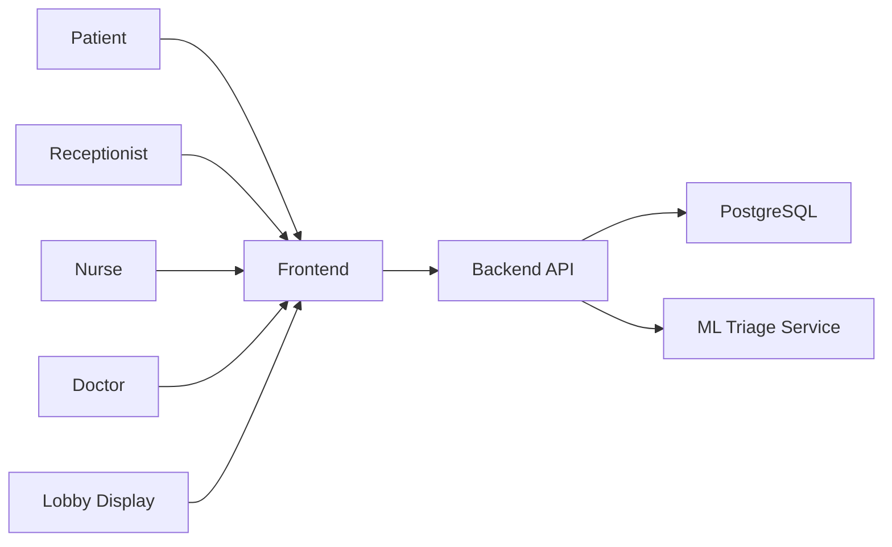
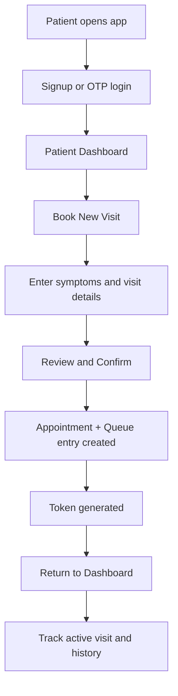
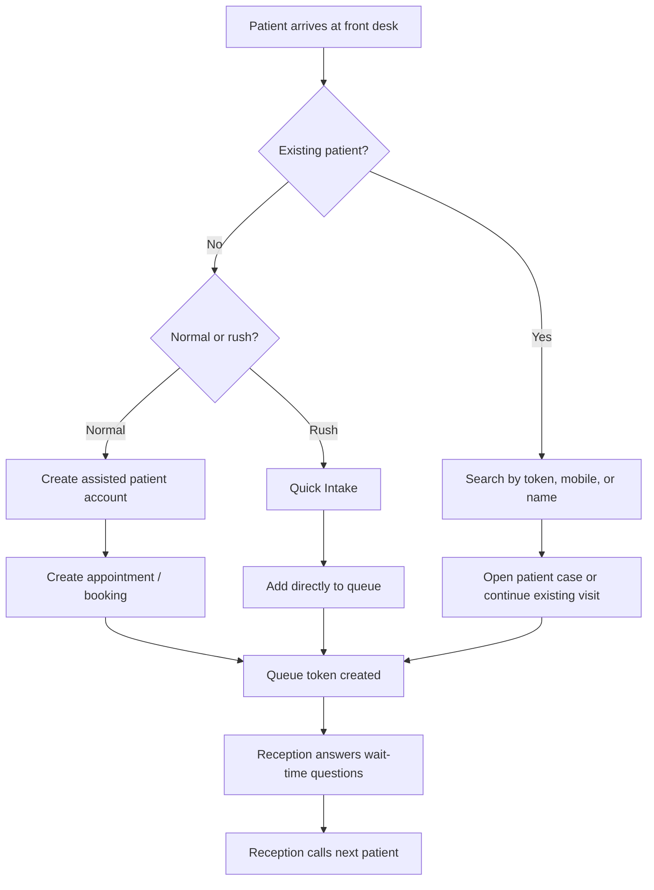
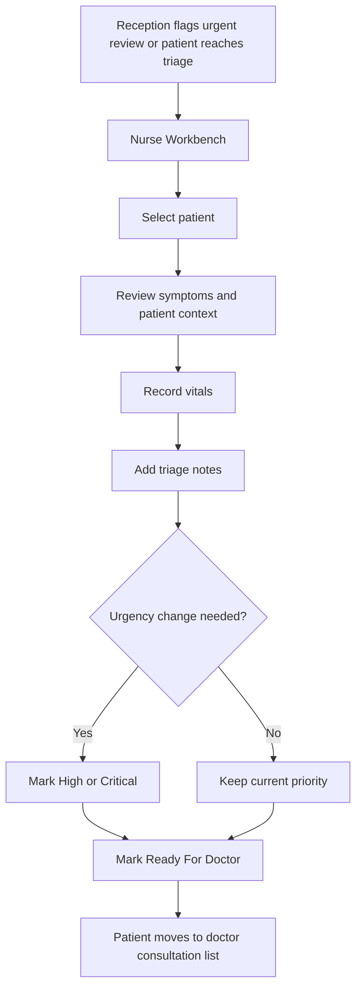
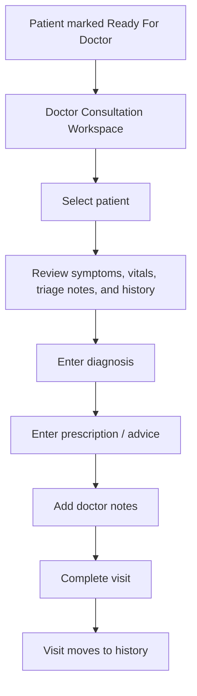
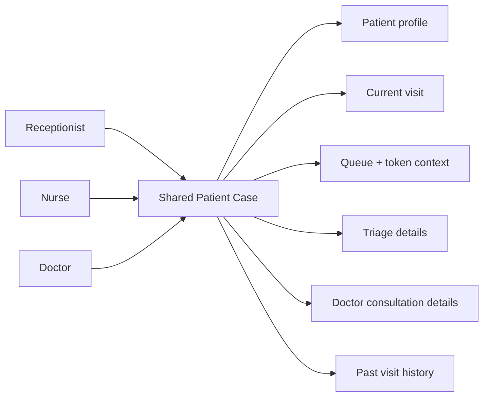
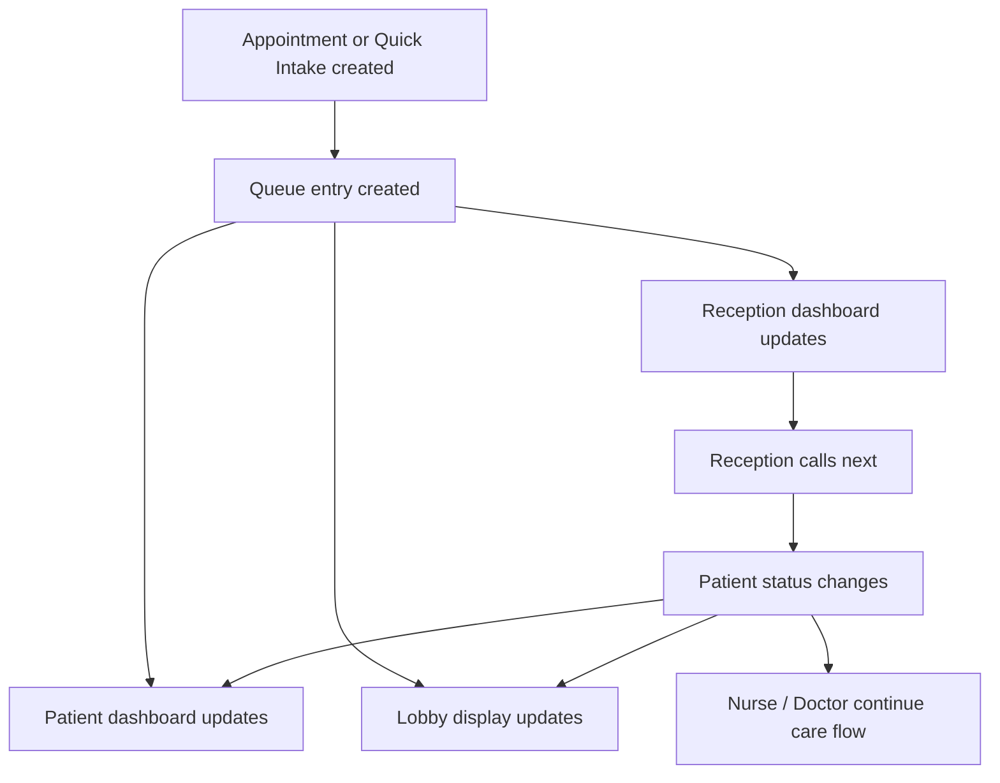
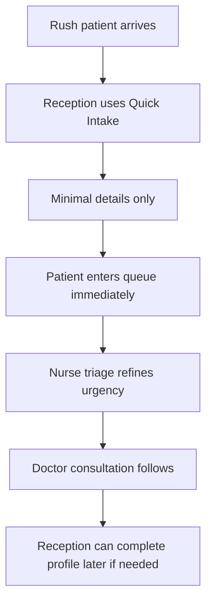
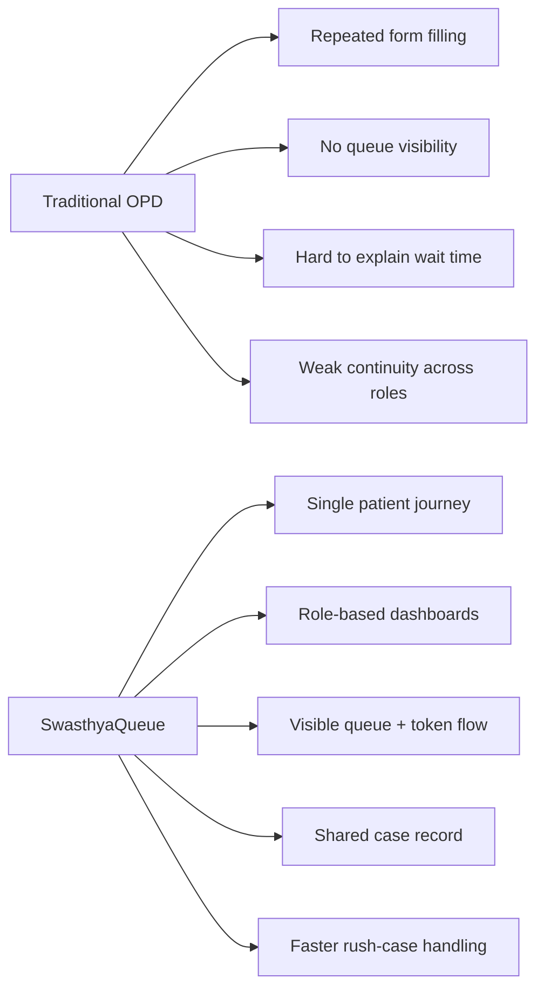

# SwasthyaQueue Flow Diagrams

This document gives visual workflow diagrams for explaining SwasthyaQueue to:

- teammates
- mentors
- evaluators
- hospital stakeholders
- demo audiences

These are written in Mermaid so they are easy to edit and can later be exported as images if needed.

## 1. System Overview

## 2. Patient Self-Service Flow

## 3. Receptionist Assisted Flow

## 4. Nurse Triage Flow

## 5. Doctor Consultation Flow

## 6. Shared Patient Case Page

## 7. Queue and Lobby Display Flow

## 8. Rush Case Flow

## 9. Why This System Helps

## 10. Case Study Coverage

Yes, case studies are still useful even with diagrams.

Use diagrams to explain:

- structure
- movement of data
- role interaction

Use case studies to explain:

- why this matters in real hospitals
- what happens in a cardiology case vs emergency case
- what pain points are solved in each department

Best combination for demo:

1. show one system overview diagram
2. show one role flow diagram
3. present one department case study
4. then run the live demo

## Suggested Presentation Order

1. System Overview
2. Receptionist Assisted Flow
3. Nurse Triage Flow
4. Doctor Consultation Flow
5. Rush Case Flow
6. One or two case studies from [DEMO_CASE_STUDIES.md](DEMO_CASE_STUDIES.md)

## Related Docs

- [Docs README](README.md)
- [Workflows](WORKFLOWS.md)
- [Demo Case Studies](DEMO_CASE_STUDIES.md)
- [Root README](../README.md)
